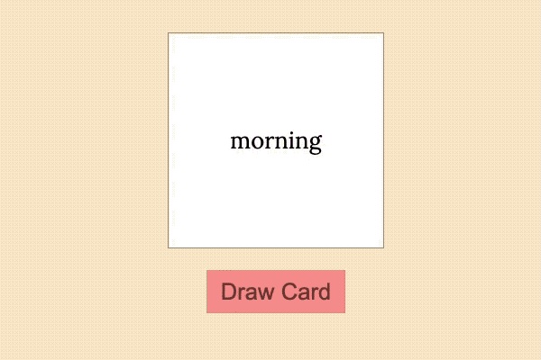

# React Flashcard

This is a simple flashcard app made by React. And use the Firebase as backend. Here's a screenshot of this app:



## Use This App

Change the `/src/config/firebase_config.js` to `firebase.js` and add your own firebase informations to the fields in the file. Then:

```bash
yarn install
# or
npm install

yarn start
# or
npm run start
```
